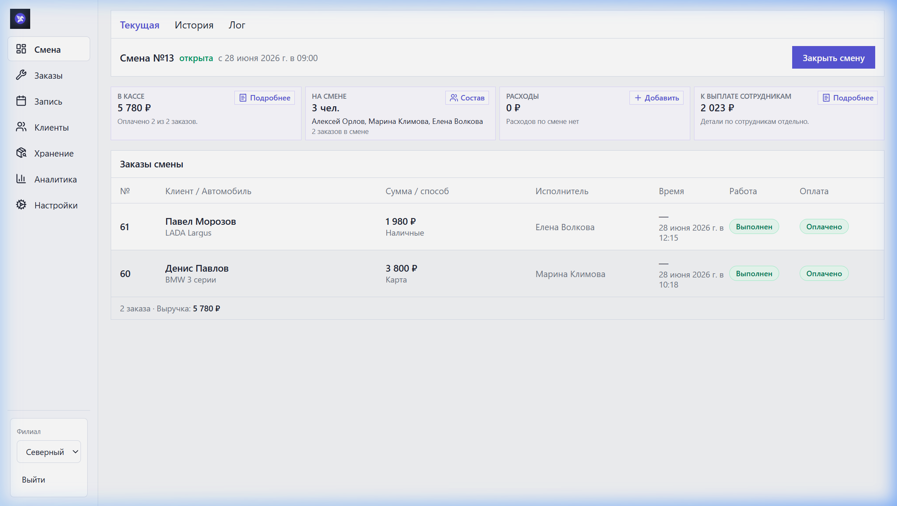

# Pegas Auto CRM/POS

У шиномонтажа всё было разбросано: услуги в Excel, запись в Google Sheets, смены и зарплаты - в тетрадях.

> Pegas Auto CRM/POS собирает это в одну систему: заказы, клиентов, услуги, оплату, смены, выплаты и аналитику.

## [Открыть живое демо](https://qxstaydemo.alwaysdata.net)

Вход без регистрации: кнопка «Открыть CRM».
Данные тестовые и могут сбрасываться.
Код, база и данные закрытого проекта не публикуются.

## Что внутри

- Заказ-наряд с клиентом, автомобилем, услугами и суммой.
- Каталог услуг вместо Excel.
- Запись на услуги вместо Google Sheets.
- Смена, касса и оплаты.
- Расчёт выплат сотрудникам.
- Клиенты, автомобили и история визитов.
- Аналитика по выручке, заказам и выплатам.

## Кому подойдёт

Автосервис, шиномонтаж или сеть филиалов, где заявки, деньги и сотрудники должны быть видны без тетрадей, Excel и ручных отчётов.

## Стек

Next.js, TypeScript, Prisma, PostgreSQL/SQLite, Docker.
